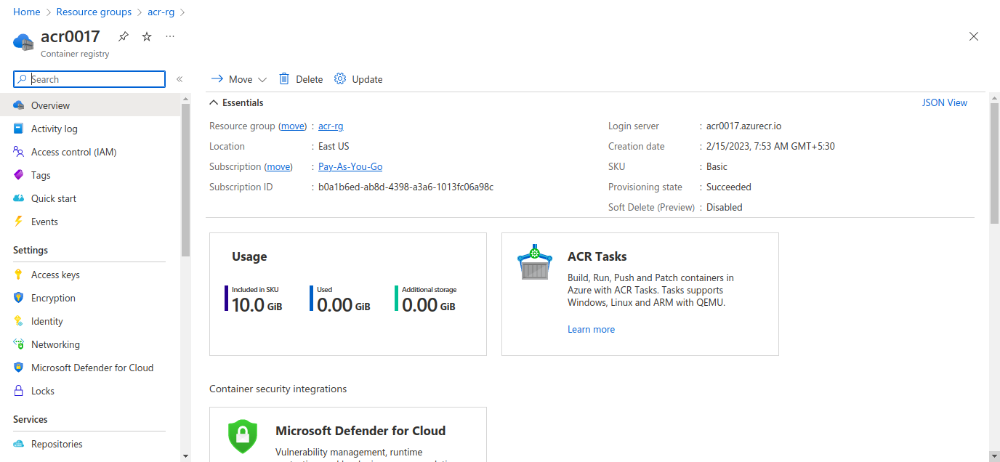

#Description

This template helps you to create acr and resource group using terraform

# Prerequisites:
* azure account
* Install azure-cli 
* Install terraform latest version

# Steps
`Go to the terminal and run the following Command`

* `az login`            
* `terraform init`
* `terraform plan` 
* `terraform apply`

As you can see in the below image  it is created resource group and the acr.

